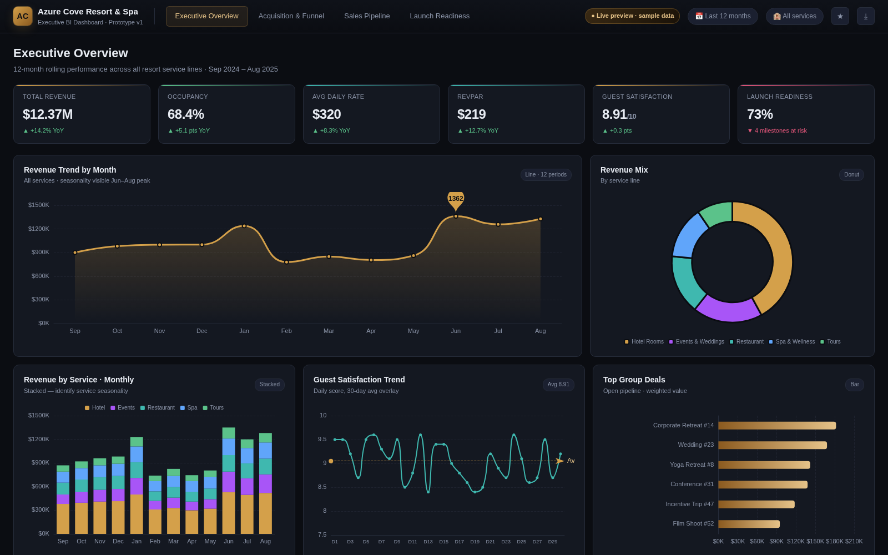
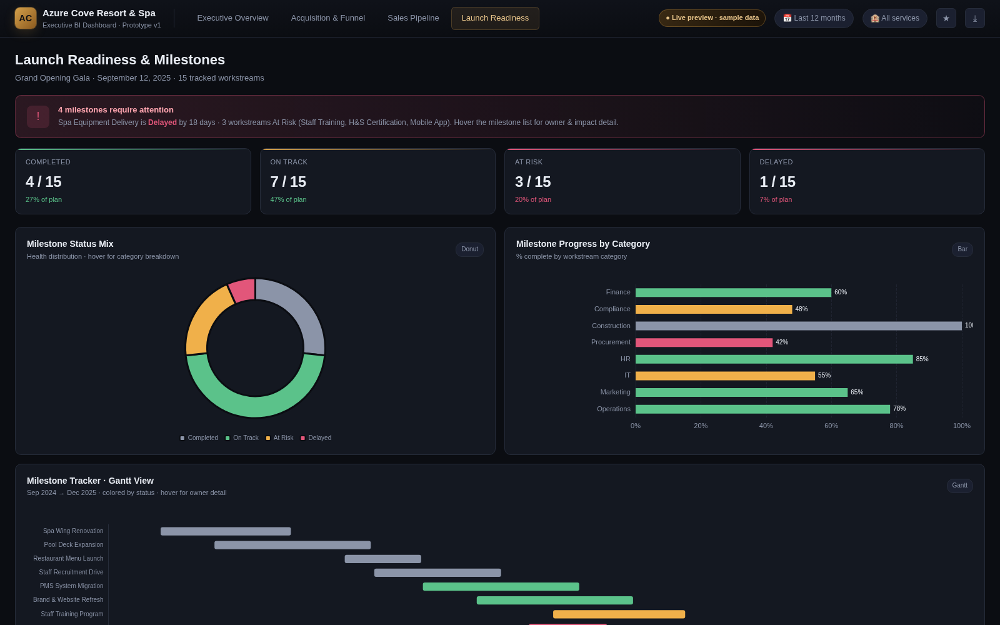

# 🏨 Azure Cove Resort & Spa — Power BI Dashboard Prototype

> A conceptual 4-page Power BI dashboard prototype for a multi-service destination business (resort + spa + restaurant + tours + events). Built with realistic mock data — ready to port to a working `.pbix` file.


---

## 🎬 Video Walkthrough

A 60-second video walkthrough of the prototype is available in `prototype-loop-B.mp4`.

## 🖼️ Preview

### Page 1 — Executive Overview


### Page 4 — Launch Readiness (Gantt + Alerts)


---

## 📊 What's Inside

A 4-page interactive dashboard covering:

| Page | Purpose | Key Visuals |
|------|---------|--------------|
| **Executive Overview** | C-level snapshot | 6 KPI cards, revenue trend, mix donut, stacked service view, satisfaction, top deals |
| **Customer Acquisition & Funnel** | Marketing & sales | 5-stage funnel, side-by-side by channel, CAC vs LTV, conversion rates |
| **Group/Business Sales Pipeline** | Sales team | Combo bar+line by stage, treemap by group type, rep performance, drill-through table |
| **Launch Readiness** | Project manager | Alert banner, Gantt timeline, milestone detail list with progress bars |

---

## 🗂️ Project Structure

```
azure-cove-resort-dashboard/
├── README.md                          ← you are here
├── data/
│   ├── fact_revenue.csv               ← 1,825 rows · daily revenue by service
│   ├── fact_customers.csv             ←    72 rows · monthly funnel by channel
│   ├── fact_pipeline.csv              ←    64 rows · group/business deals
│   └── dim_milestones.csv             ←    15 rows · launch milestones
├── screenshot-1-exec.png              ← Executive Overview preview
├── screenshot-2-funnel.png            ← Customer Acquisition & Funnel preview
├── screenshot-3-pipeline.png          ← Sales Pipeline preview
├── screenshot-4-launch.png            ← Launch Readiness preview
└── prototype-loop-B.mp4               ← 60s video walkthrough (with voiceover)
```

---

## 🎨 Design System

| Element | Value |
|---------|-------|
| Background | `#0b0d12` (deep ink) |
| Surface | `#141821` |
| Gold accent | `#d4a04a` / soft `#e6c389` (luxury resort vibe) |
| Status colors | Green `#5bc28a` · Amber `#f0b04a` · Red `#e2567a` |
| Info colors | Teal `#3fb8af` · Blue `#60a5fa` · Purple `#a855f7` |
| Typography | Segoe UI (Power BI default), 14px body, 24px KPI |
| Radius | 10px cards, 8px KPI accents |

---

## 🛠️ Built With

- **HTML / CSS / JS** — interactive preview (`index.html` not included in public repo, available on request)
- **Apache ECharts 5.5** — chart rendering
- **Python** — mock data generation
- **Power BI Desktop** — the prototype is designed to port directly to a working `.pbix` file

---

## 📅 Sample Data Coverage

- **Period:** Sep 1, 2024 → Aug 31, 2025 (12 months)
- **Services:** Hotel Rooms · Spa & Wellness · Restaurant · Tours & Activities · Events & Weddings
- **Channels:** Direct Website · OTA · Travel Agent · Social Media · Referral · Corporate
- **Pipeline stages:** Lead · Qualified · Proposal Sent · Negotiation · Won · Lost
- **Milestone categories:** Construction · Operations · HR · IT · Marketing · Procurement · Compliance · Finance

---

## 🔄 Power BI Porting Plan

The prototype is designed to mirror a Power BI report exactly. To build the `.pbix`:

1. **Import data:** Power BI Desktop → Get Data → Text/CSV → import 4 CSVs
2. **Data model:** Star schema — fact tables in center, dimensions around
3. **DAX measures:** Total Revenue, Occupancy %, Conversion Rate, Weighted Pipeline, Launch Readiness %
4. **Theme:** Import theme JSON with the colors above
5. **Visuals:** Match the 4-page layout — same KPI cards, chart types, interactions

---

## 📈 Key Metrics Showcased

| Metric | Value |
|--------|-------|
| Total Revenue (12 months) | $12.37M |
| Occupancy Rate | 68.4% |
| Average Daily Rate (ADR) | $320 |
| RevPAR | $219 |
| Guest Satisfaction | 8.91 / 10 |
| Launch Readiness | 73% |
| Total Visitors (funnel top) | 136,623 |
| Total Bookings (funnel conversion) | 6,398 |
| Open Sales Pipeline | $4.79M |
| Weighted Forecast | $3.26M |
| Won YTD | $1.76M |
| Win Rate | 70% |

---

## 📋 Power BI Interactions Implemented

- **Tooltip pages** — hover detail on pipeline table rows & milestone list rows
- **Drill-through** — from summary table to deal detail
- **Bookmark concept** — "Executive View" vs "Ops View"
- **Conditional formatting** — status pills colored by stage, progress bars by status
- **Page navigation** — top tabs across 4 pages

---


> **Note:** The interactive HTML preview (`index.html`), available only to clients on request.

---

## 📬 Contact

Built by **senaerdemm2** — available for Power BI dashboard freelancing on Upwork.

- 🐙 GitHub: [senaerdemm2](https://github.com/senaerdemm2)
- 📊 Other Power BI projects:
  - [`it-support-ticket-analysis`](https://github.com/senaerdemm2/it-support-ticket-analysis) — SQL + Power BI + Power Automate
  - [`olist-ecommerce-analysis`](https://github.com/senaerdemm2/olist-ecommerce-analysis) — E-commerce analytics with Power BI

---

*Confidential prototype · September 2025 · Azure Cove Resort & Spa*
